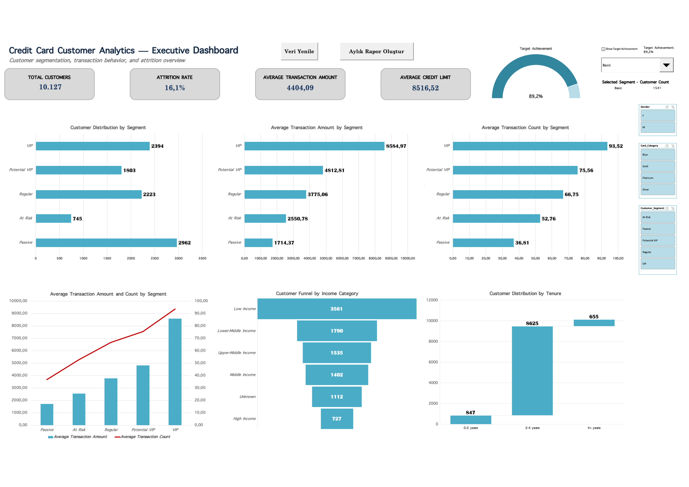
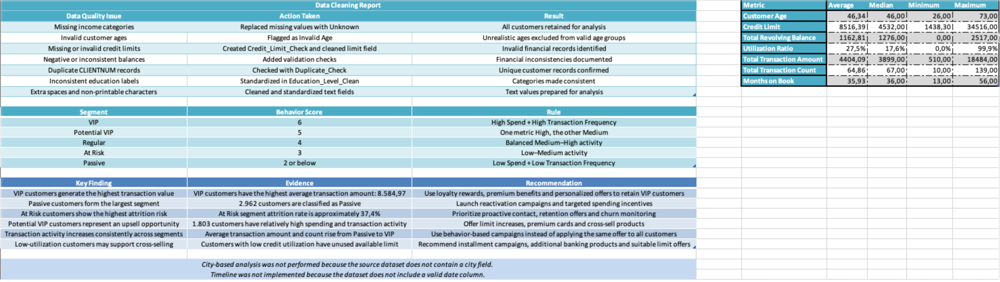

# Credit Card Customer Segmentation Analysis

An end-to-end Excel project focused on data cleaning, customer segmentation, exploratory analysis, scenario modeling, interactive dashboards, and VBA automation using a credit card customer dataset.

## Project Objective

The objective of this project is to analyze credit card customer behavior and segment customers into five actionable groups:

- VIP
- Potential VIP
- Regular
- At Risk
- Passive

The analysis supports customer retention, cross-selling, campaign targeting, and risk management decisions.

## Dataset

The dataset contains 10,127 credit card customers and includes:

- Customer demographics
- Income and education information
- Credit limits and utilization ratios
- Transaction amount and transaction count
- Customer relationship duration
- Attrition status
- Card category
- Customer activity indicators

The original dataset also contained deliberately introduced data quality problems such as:

- Missing income categories
- Invalid customer ages
- Missing or inconsistent credit limits
- Duplicate records
- Inconsistent education labels
- Text formatting issues

## Data Cleaning

The following controls and transformations were applied:

- Missing income categories were replaced with `Unknown`
- Invalid ages were identified and excluded from valid age groups
- Credit limit validation fields were created
- Duplicate `CLIENTNUM` records were checked
- Education categories were standardized
- Extra spaces and non-printable characters were cleaned
- Data quality checks were documented in a dedicated worksheet

## Data Transformation

New analytical fields were created, including:

- Age Group
- Tenure Group
- Credit Utilization Level
- Monthly Spend
- Average Transaction Value
- Spend Level
- Transaction Frequency Level
- Behavior Score
- Customer Segment
- Customer Value Tier
- Clean Income Category

## Excel Techniques Used

### Formulas

- Named Ranges
- `LET`
- `FILTER`
- `XLOOKUP`
- `SUMIFS`
- `COUNTIFS`
- `IF`
- `IFS`
- `SWITCH`
- `INDEX`
- `INDIRECT`
- `OFFSET`

### Pivot Analysis

- Customer distribution by age group
- Customer distribution by gender
- Customer distribution by tenure
- Card category performance
- Income category analysis
- Education level comparison
- Segment-level transaction analysis
- Attrition analysis
- Credit limit comparison

### Scenario and Optimization Tools

- One-variable Data Table
- Goal Seek
- Scenario Manager
- Solver
- What-If Analysis

### Visualizations

- Waterfall Chart
- Funnel Chart
- Combo Chart
- Gauge Chart
- Bar Charts
- Sparklines
- Conditional Formatting
- Dynamic chart titles

### Dashboard Controls

- Slicers
- Dropdown control
- Checkbox control
- Spinner control
- Dynamic KPI cards
- Dynamic customer selection

### VBA Automation

- Data Refresh button
- Monthly Report button
- User-friendly message boxes

## Segmentation Logic

The segmentation model combines spending and transaction frequency scores.

| Segment | Behavior Score | Rule |
|---|---:|---|
| VIP | 6 | High Spend + High Transaction Frequency |
| Potential VIP | 5 | One metric High, the other Medium |
| Regular | 4 | Balanced Medium–High activity |
| At Risk | 3 | Low–Medium activity |
| Passive | 2 or below | Low Spend + Low Transaction Frequency |

## Key Findings

- VIP customers have the highest average transaction amount.
- Passive customers form the largest segment.
- At Risk customers have the highest attrition rate.
- Potential VIP customers represent a strong upsell opportunity.
- Transaction amount and transaction count increase consistently from Passive to VIP.
- Low-utilization customers may support cross-selling opportunities.

## Business Recommendations

### VIP Retention

- Offer loyalty rewards
- Provide premium card benefits
- Use personalized campaigns
- Monitor early churn indicators

### Potential VIP Development

- Offer suitable credit limit increases
- Promote premium cards
- Recommend complementary banking products
- Create targeted upgrade campaigns

### At Risk Customers

- Prioritize proactive customer contact
- Use retention incentives
- Monitor inactivity and declining transaction behavior
- Apply churn prevention campaigns

### Passive Customers

- Launch reactivation campaigns
- Offer spending incentives
- Use behavior-based communication
- Test personalized campaign offers

## Descriptive Statistics

The project includes descriptive statistics for:

- Customer Age
- Credit Limit
- Total Revolving Balance
- Utilization Ratio
- Total Transaction Amount
- Total Transaction Count
- Months on Book

Metrics include average, median, minimum, and maximum values.

## Limitations

- City-based analysis was not performed because the dataset does not contain a city field.
- Timeline functionality was not implemented because the dataset does not include a valid date column.
- Power BI analysis was considered an optional extension and is not included in this repository.

## Repository Structure

    credit-card-customer-segmentation/
    ├── credit_card_customer_segmentation_analysis.xlsm
    ├── dashboard.png
    ├── documentation.png
    └── README.md

## Tools

- Microsoft Excel for Mac
- PivotTables
- Solver
- VBA
- GitHub

## Author

Hilal Yiğit  
